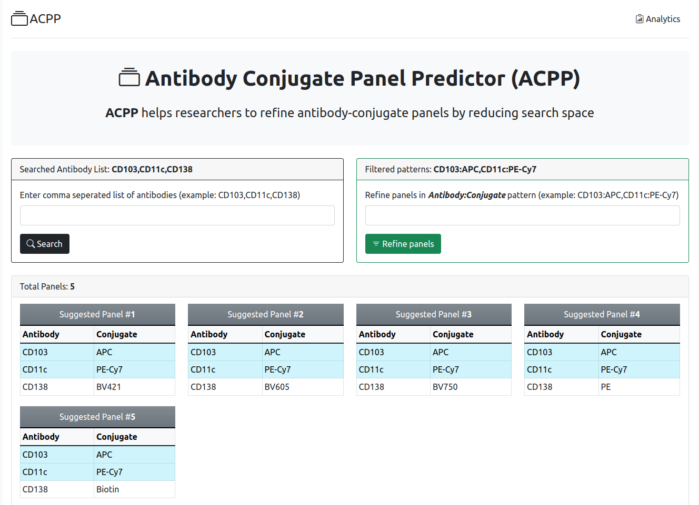

## Predictor of Antibody colors: [Live demo](https://ashovon.pythonanywhere.com/)
Filters combinations from antibody conjugate pairs.

## Live demo
Live demonstration at [ashovon.pythonanywhere.com](https://ashovon.pythonanywhere.com/)

## Installation
- Create and activate virtual environments:
```shell
python3 -m venv venv
source venv/bin/activate
```
- Install the required packages:
```shell
pip install -r requirements.txt
```

## Run web app

- Run the web application:

```shell
flask run
```



### SQL command
- Init db:
```shell
flask db init
```
- Migrate:
```shell
flask db upgrade
```

## Run CLI App

- Run the [inventory_predictor.py](inventory_predictor.py) file using Python3
  and follow the on-screen instructions.

```text
python inventory_predictor.py
Antibody list: CD103, CD11c, CD138
------------------------
CD103 has 4 conjugates: APC, APC-R700, BV711, PE
CD11c has 3 conjugates: BUV805, eFluor450, PE-Cy7
CD138 has 5 conjugates: APC, BV421, BV605, BV750, PE
========================
Total panels found: 54

Suggested Panel #1
--------------------
CD103: APC
CD11c: BUV805
CD138: BV421

Suggested Panel #2
--------------------
CD103: APC
CD11c: BUV805
CD138: BV605

...
...
...

Suggested Panel #53
--------------------
CD103: PE
CD11c: PE-Cy7
CD138: BV605

Suggested Panel #54
--------------------
CD103: PE
CD11c: PE-Cy7
CD138: BV750
========================
Enter number of conditions (0 to exit): 2
Enter condition in "Antibody:Conjugate" pattern (e.g. CD103:APC)
Enter condition #1: CD103: APC
Enter condition #2: CD11c: PE-Cy7
========================
Total panels found: 4

Suggested Panel #1
--------------------
CD103: APC
CD11c: PE-Cy7
CD138: BV421

Suggested Panel #2
--------------------
CD103: APC
CD11c: PE-Cy7
CD138: BV605

Suggested Panel #3
--------------------
CD103: APC
CD11c: PE-Cy7
CD138: BV750

Suggested Panel #4
--------------------
CD103: APC
CD11c: PE-Cy7
CD138: PE
========================

Enter number of conditions (0 to exit): 1
Enter condition in "Antibody:Conjugate" pattern (e.g. CD103:APC)
Enter condition #1: CD138: PE
========================
Total panels found: 1

Suggested Panel #1
--------------------
CD103: APC
CD11c: PE-Cy7
CD138: PE
========================

Enter number of conditions (0 to exit): 0
Program terminated
```

### References

- [Stackoverflow answer: All combinations from dictionary](https://stackoverflow.com/a/61335465/3129414)
- [Flask minimal example](https://flask.palletsprojects.com/en/2.2.x/quickstart/#a-minimal-application)
- [Flask user management](https://www.digitalocean.com/community/tutorials/how-to-add-authentication-to-your-app-with-flask-login)