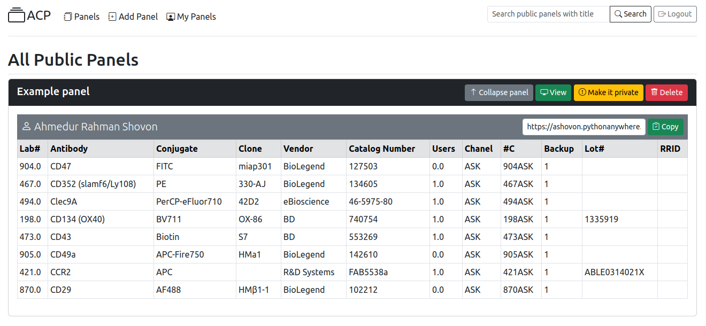

## Predictor of Antibody colors: [Live demo](https://ashovon.pythonanywhere.com/)
Filters combinations from antibody conjugate pairs.

## Live demo
Live demonstration at [ashovon.pythonanywhere.com](https://ashovon.pythonanywhere.com/)

## Installation
- Create and activate virtual environments:
```shell
python3 -m venv venv
source venv/bin/activate
```
- Install the required packages:
```shell
pip install -r requirements.txt
```

## Run web app

- Run the web application:

```shell
flask run
```



### SQL command
- Init db:
```shell
flask db init
```
- Create migration script:
```shell
flask db migrate -m "Add publish column"
```
- Migrate:
```shell
flask db upgrade
```
### References

- [Flask minimal example](https://flask.palletsprojects.com/en/2.2.x/quickstart/#a-minimal-application)
- [Flask user management](https://www.digitalocean.com/community/tutorials/how-to-add-authentication-to-your-app-with-flask-login)